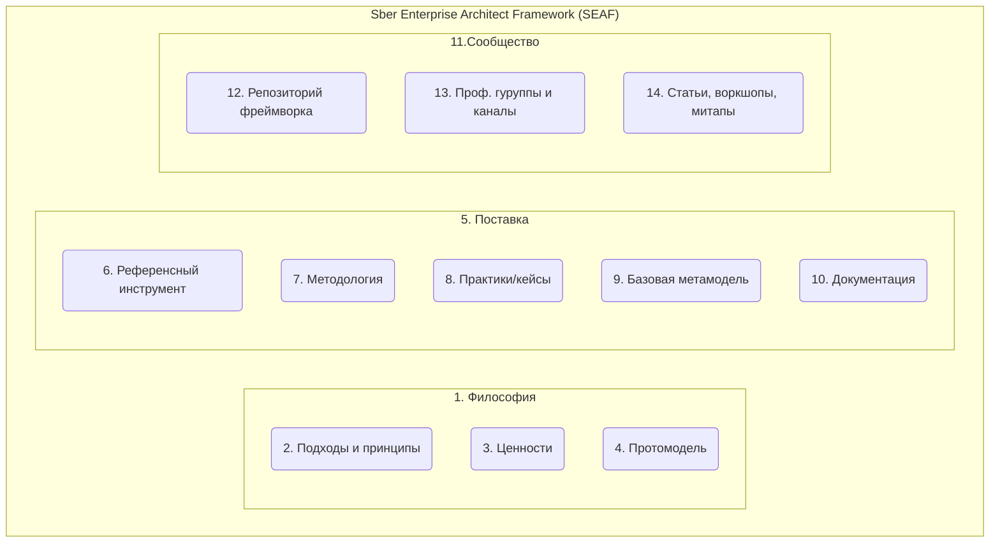
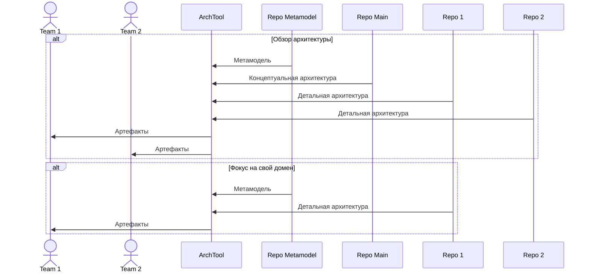
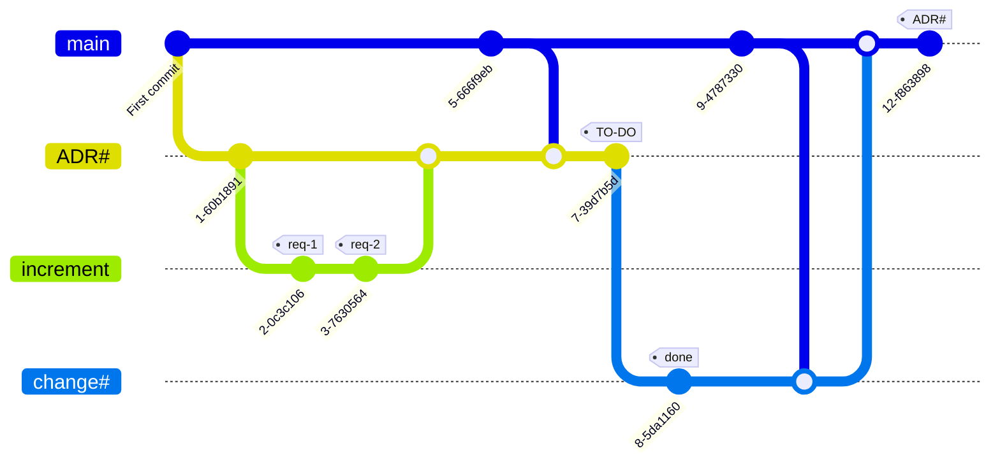
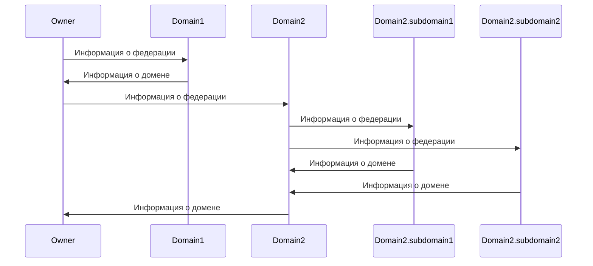
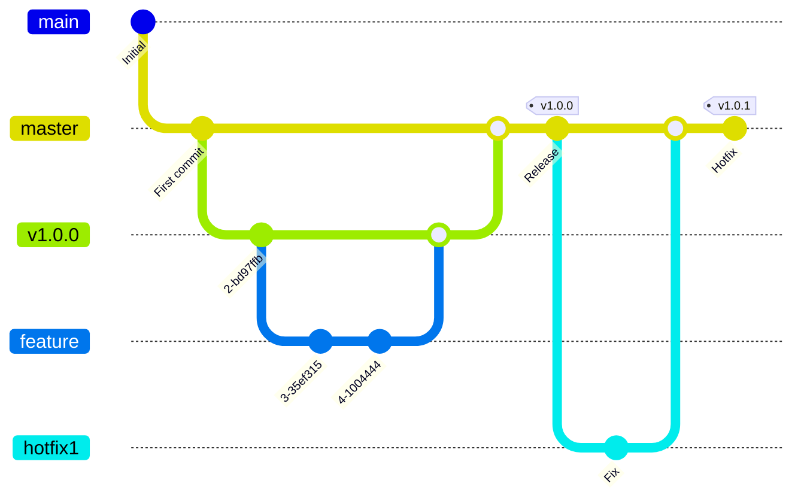

# SEAF
Sber Enterprise Architecture Framework (SEAF) - открытый и развиваемый сообществом экспертов-практиков 
архитектурный фреймворк в своей основе использующий подход "Архитектура как код".

## Быстрый старт

1. Ознакомьтесь с [документацией](https://gitverse.ru/seafteam/seaf-archtool-core#user-content-быстрый-старт) и установите [актуальную версию ArchTool](https://gitverse.ru/seafteam/seaf-archtool-core/releases).
Для первого ознакомления рекомендуется использовать вариант развертывания в виде плагина для IDEA (файл SEAF.ArchTool.JBPlugin-х.хх.х);
2. Клонируйте данный репозиторий;
3. Откройте проект в IDE.

## Архитектура фреймворка

* (1, 2, 3, 4) Философия фреймворка выражается в [манифесте](#манифест);
* (5) Под поставкой понимается выпуск очередного релиза фреймворка в форме repo;
* (6) В качестве референсного инструмента предлагается [ArchTool](https://gitverse.ru/seafteam/seaf-archtool-core#user-content-быстрый-старт);
* (7) Методология включается в виде документов в поставку;
* (8) Поставка содержит [пример](https://github.com/SEAFTeam/seaf-dzo-example) описания архитектуры,
  а также предлагается [репозиторий примеров применения подхода на gitverse](https://gitverse.ru/seafteam/seaf-examples);
* (9) Входит в поставку;
* (10) Входит в поставку;
* (11) Сообщество обеспечивает развитие фреймворка и генерирует поставку;
* (12) [Репозиторий фреймворка](https://github.com/SEAFTeam/seaf-core);
* (13) Закрытая телеграм-группа сообщества развивающего подход управления архитектуры кодом;
* (14) [Контент (видео) в канале сообщества с воркшопами и митапами](https://rutube.ru/channel/32378011/).

## Метамодель

SEAF предусматривает мутабельность метамодели. Ее постоянное совершенствование
сообществом.

### Базовый подход к формированию слоев и вертикалей

Для структурирования метамодели выбран подход разделения ее на слои и вертикали.

Слои выделяют функциональные области, в то время как вертикали пронизывают их 
и связывают.

Выделяются слои:
1. Бизнес-архитектура;
2. Прикладная архитектура;
3. Техническая архитектура.

Вертикали:
1. Информационная архитектура;
2. Управление требованиями.

Важным принципом метамодели является - адаптивность. Она должна
легко подстраиваться под нужды использования. Предусматривать частичное применение,
возможность расширения и модификации.

Таким образом, решение о фактическом объеме использования метамодели 
предоставляется пользователю. 

### Общая метамодель


## Архитектурный репозиторий

В основе SEAF лежит подход "Архитектура как код". Любое архитектурное описание
выражается архитектурным кодом - **архкодом**. Для управления им актуальны практики
управления кодом приложений, инфраструктуры и т.п.

Но есть и отличия ввиду специфики предметной области - управление архитектурой.

Для удобства сообщества фреймворк предлагает стандартизацию некоторых аспектов
управления архкодом. 

### Соглашение по структуре архитектурных репозиториев
```

|- _metamodel_                 - Подключенные пакеты метамоделей
|  |- [название пакета]        - Пакет метамодели
|  |  |- entities              - Сущности метамодели
|  |  |  |- [...]              - Структура каталогов сущностей
|  |  |  |  |- template        - Шаблоны для презентаций
|  |  |- functions             - Запросы написанные на JSONata
|  |  |- docs                  - Документация по репозиторию
|  |  |- architecture          - Архитектурные объекты поставляемые с пакетом
|  |  |  |- app                - Прикладная архитектура
|  |  |  |- ba                 - Бизнес-архитектура
|  |  |  |- ta                 - Техническая архитектура
|  |  |  |- ia                 - Информационная архитектура
|  |  |- dochub.yaml           - Корневой манифест пакета
|  |  |- README.md             - Описание пакета
|  |  |- LICENSE               - Лицензия под которой распространяется пакет
|- architecture                - Архитектурные объекты
|  |- app                      - Архитектурные объекты
|  |- ba                       - Бизнес-архитектура
|  |- ta                       - Техническая архитектура
|  |- ia                       - Информационная архитектура
|- facades                     - Подключаемые внешние архитектурные объекты
|- README.md                   - Ключевая информация по репозиторию
|- dochub.yaml                 - Корневой манифест репозитория
```

Предлагаемая структура является рекомендуемой и может расширяться при необходимости.

### Соглашение по идентификации архитектурных объектов

1. Идентификаторы должны соответствовать принципу DDD (структурированные идентифкаторы);
2. Используются только строчные символы;
3. Для разделения домена используется символ - "."
4. Для разделения слов - "_";
5. Системные идентификаторы должны начинаться с "$";
6. В идентификаторах могу быть использованы только символы - a..z 0..9 "_" "." "$";
7. Идентификаторы должны отражать смысл и быть существительным.

**RegEx для идентификаторов:** ^\[a-z0-9_\$]\[a-z0-9_\$]\*(\.\[a-z0-9_\$]\[a-z0-9_\$]\*)*$

Предлагается следующая структура идентификаторов:
```
[зона www].[домен].**
```

Примеры:
```
info.dochub.frontend
ru.nalog.site_fns
ru.yandex.app.search
```

## Процессы управления

Использование систем управления версиями положено в основу предлагаемых процессов. 

### Сегментация кодовой базы

Рекомендуется сегментировать кодовую базу в соответствии с логическими пространствами
доменов управления, придерживаясь принципов федеративного управления архитектурой.

Например, если вы практикуете микросервисную архитектуру, будет уместно выделить следующие сегменты
и разместить их в отдельных репозиториях:

1. **Metamodel** - стандартизированная метамодель, которую будут использовать и развивать все команды;
2. **General** - репозиторий обобщающий информацию о всех микросервисах и представляющий их как систему
   для нужд всех команд;
3. **TeamN** - репозиторий команды, в котором она развивает архитектуру микросервисов.

Такое разделение позволит минимизировать информационный шум для участников архитектурных преобразований,
а также настроить ролевую модель.

Для удобства разработчиков, архкод развиваемый командой, допускается расположить непосредственно в 
репозиториях микросервисов.



Связать репозитории и представить их в едином интерфейсе позволит референсный инструмент -
[ArchTool](https://gitverse.ru/seafteam/seaf-archtool-core).

### Развитие архкода

В качестве целей развития архкода рассматривается :
1. Проектирование и планирование архитектурных изменений (to-be);
2. Фиксация и документирование состоявшихся изменений (as-is).

Для реализации этих целей предлагается следующий процесс: 



Здесь ветка **"main"** отражает "как есть", т.е. представление о том, какая архитектура
имеется на текущий момент.

При необходимости архитектурных преобразований, создается ветка **ADR (Architecture Decision Record)**.
Первоначально в ветке отражается суть преобразований. Т.е. регистрируется сам ADR.

ADR подразумевает одно преобразование или их комплекс. Каждое целевое преобразование
оформляется как архитектурный инкремент - **Increment**.

Increment отщипывается от ветки ADR и развивается в соответствии с требованиями по
преобразованию. При завершении имплементации требования, комит тегируется 
исполненным требованием. Это делается для удобства контроля полноты реализации
ADR, а также позволяет локализовывать сегмент архкода отвечающий за них.

По завершению наполнения инкремента, он вливается в ветку ADR.

Когда ветка ADR скомплектована, она тегируется к реализации **"to-do"**.

Готовые к реализации ADR берутся в работу. Для этого от ADR отщипывается ветка
**"change"**. В ходе реализации ветки, допускается детализация архкода без 
противоречия сути ADR.

После имплементации преобразований, ветка change вливается в main. 
Таким образом происходит актуализация архитектуры "как есть". Актуализация
тегируется исполненным ADR с целью контроля его реализации.

Если ADR оказывается слишком сложным (большим), необходимо его декомпозировать.
Для этого использовать подход структурирования идентификаторов. Например, ADR по 
созданию новой системы с номером ARD12 разделить на: ADR12.1; ADR12.2 и т.д.

Такая идентификация позволит не утерять смысл при чтении тегов и проще 
контролировать целостность преобразований.

__При развитии архкода, на постоянной основе, должна происходить синхронизация с веткой
main для актуализации знаний о реальной архитектуре с целью контроля реализуемости 
проектируемых изменений.__

### Федеративное управление архитектурой

SEAF рассматривает федеративное управление архитектурой как инструмент эффективного
управления архитектурой в сложных, неоднородных системах и системах с динамической
сложностью.

Федерация это совокупность доменов с автономным управлением связанная в систему
контрактами.

#### Домены управления

Для разделения на домены управления необходимо определить критерии. Для каждого 
случая они могут быть уникальными. Типовые:
* Организационная единица (департамент, управление, команда и т.д);
* Продуктовая единица (цифровой продукт, вертикаль и т.д.);
* Сервисная единица (сервис авторизации, сервис оплаты и т.д.).

При выделении домена необходимо стремиться к однородности процесса
управления архитектурой в нем. Признаками могут стать единые стандарты для
домена, технологический стек, единый релизный цикл и т.д.

Домену выделяется пространство имен, в котором он описывает архитектурные объекты 
и специфичную метамодель. 

Например:
- ru.company.it.auth.*
- ru.company.product1.*  

#### Контракты

При выделении домена с ним заключается контракт. Контракт подразумевает доступ
домена к информации об архитектуре федерации в обмен на обязательства предоставлять 
информацию о себе.

Структура и состав информации поступающей из федерации и из домена декларируется
специальный метамоделью. Таким образом поддерживается необходимое качество и актуальность 
информации на уровне федерации.

Контракт актуализируется по мерен необходимости.

#### Передача управления в домен

После определения рамок домена управления и контрактов с ним, управление архитектурой
передается в домен. Он волен развивать свою частную метамодель под свои нужды.

Контролируется функционирование домена исключительно по выполнению контракта.

#### Право домена на автономное развитие

Внутри себя домен волен создавать собственную федерацию на иных принципах деления
на домены, с локальными контрактами и т.д.

#### Процесс



## Развитие фремворка

### Манифест

1. Вклад сообщества в развитие фреймворка является наивысшей ценностью для нас.

2. Миссия сообщества SEAF - создание технологии цифровой моделей предприятия. Мы считаем, что достичь ее можно
   описывая архитектуру специальным кодом, поддающимся автоматизированному анализу.

3. Мы не противопоставляем SEAF другим фреймворкам. Наш принцип – использовать лучшее из них.

4. Мы считаем, что SEAF должен удовлетворять потребностям предприятий любого масштаба. Обеспечивать их ценностью
   на всех этапах развития.

5. Мы признаем, что архитектурная функция распределена между всеми участниками трансформаций, поэтому он основан
   на простоте и низком пороге входа для любого участника изменений. Наш фреймворк не требует выделенной роли архитектора.

6. Мы поставляем метамодель и методологию, которые должны адаптироваться и развиваться под потребности конкретного
   предприятия, выявленные домены и слои архитектуры.

7. Эти принципы мы создали на основе нашего успешного опыта управления архитектурой в Группе Сбер. Мы верим, что
   они наделяют SEAF уникальными способностями:
    * Cтимулировать инновации архитектурной функции;
    * Аккумулировать и распространять лучшие практики;
    * Создавать условия для коллаборации в сложных системах управления.

### Развитие кодовой базы фреймворка

Управляет релизным циклом команда развития SEAF. Мы используем следующий процесс:     



### Как сделать вклад 

Сделайте форк данного репозитория под своей учетной записью в GitHub. 
Внесите изменения и оформите Pull Request в ветку master.

Pull Request будет рассмотрен командой развития. В случае успешного ревью он 
автоматически войдет в следующий релиз.

При наличии замечаний, они будут оформлены как комментарии в Pull Request. 

При необходимости команда развития свяжется с вами для уточнений.

## Лицензия

Распространяется под лицензией Apache License 2.0 Open source license.


