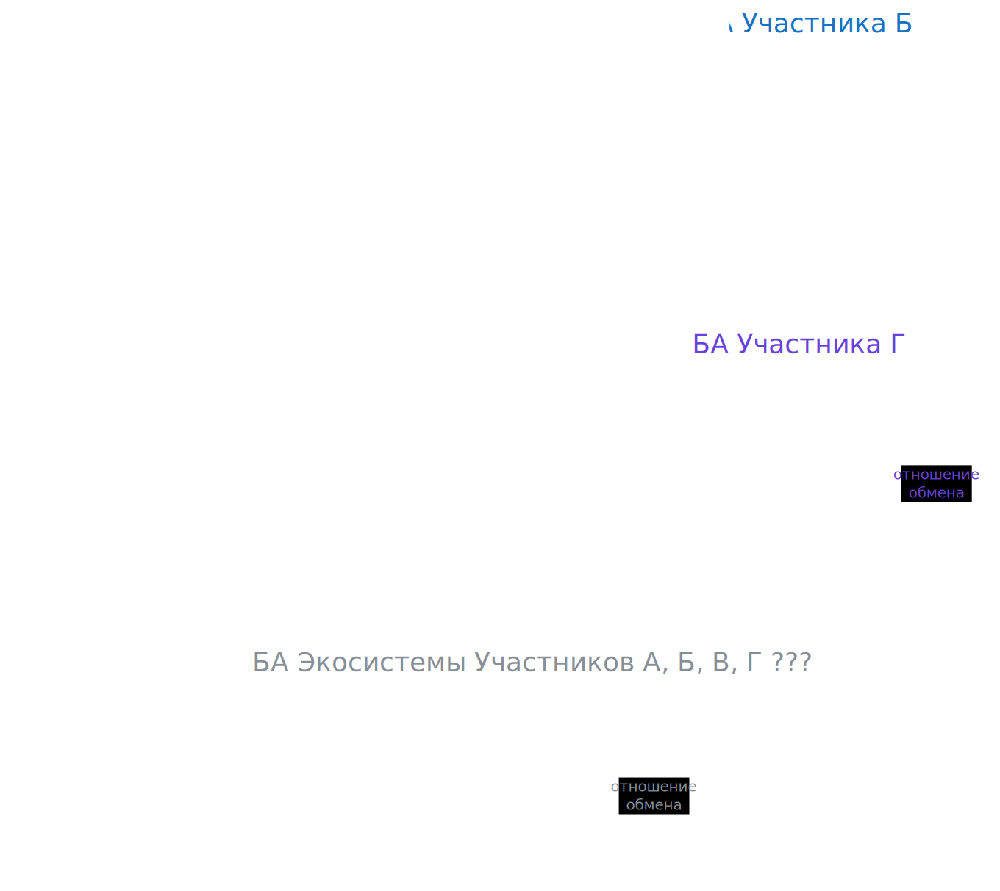
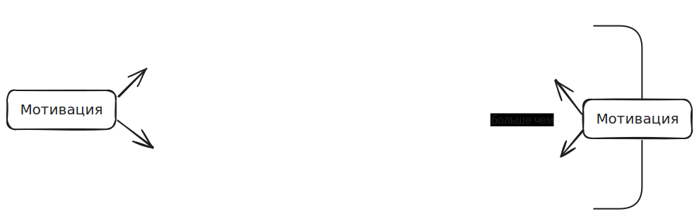

###### :orange_book: ba_main.md

---
# Архитектура Бизнеса (БА)

### Участники и Продукты

Человек, в отличие от любых других элементов природной экосистемы, обладает амбициями -- стремлением к лучшему и большему.

Для удовлетворения своих амбиций Человек использует креативные способности при:
* трансформации ресурсов (создании искусственного)
* обмене ресурсами (с намерением получить выгоду)

Физические, юридические, государственные, неформальные объединения и аналитические группы лиц, участвующие в обмене ресурсами (товарами, услугами, деньгами, информацией, вниманием, возможностями и пр.) с намерением преуспеть  в удовлетворении своих амбиций -- **Участники** обмена.

Обмен ресурсами сопряжен с установлением отношений с другими Участниками. Каждый Участник находится в центре системы, образованной его социально-экономическими отношениями. Такую систему будем называть **БА** Участника.

Обмен между Участниками происходит, если разница в ценности между ресурсами отдаваемыми и ресурсами получаемыми -- **субъективно** положительна с точки зрения каждого из Участников обмена. Иными словами, каждый Участник управляет своей БА (устанавливает, поддерживает, прекращает отношения) исходя из собствееной мотивации. Мотивация -- это комплекс факторов, воздействующих на Участника, и воспринимаемых им через свою "систему ценностей". Мотивация применительно к организациям имеет форму Стратегии и Трансформации [TBD](https://github.com/altershaman/StrategyTransformation.git)

Трансформация ресурсов сопряжена с необходимостью наличия у Участников производственных возможностей (способностей), которые, в свою очередь, также были получены в результате обмена.

Весь спектр трансформаций-обменов от изъятия природных ресурсов до конечного потребления товаров и услуг образует глобальную социально-экономическую систему. Область этой системы, на которую оказывает влияние Участник, и, которая оказывает влияние на Участника, есть "зона интереса" Участника. Участник управляет своей зоной интереса путем планирования, реализации, поддержания и прекращения отношений обмена с другими Участниками. Т.о., управление БА в общем случае -- это:

* установление, поддержание и прекращение отношений с другими Участниками -- своим внешним окружением, контрагентами

* организация собственных ресурсов и способностей -- внутреннего устройства для реализации отношений во внешнем окружении.  

Т.о. каждый Участник имеет **свою** точку зрения на БА, и поэтому, описание БА начинается с определения Участников [(см. "Минимальная БА", раздел "Окружение компании)](/docs/seaf.ba.tutorial).

Для того, чтобы обмен состоялся, необходим способ или механизм, с помощью которого два или более Участников могут произвести обмен.

В общем случае, всегда есть Участник, который **предоставляет** Продукт -- это Владелец Продукта. Выставляя Продукт во внешнее окружение, Владелец предлагает другим Участникам **пользоваться** Продуктом.

Т.о., Продукт может иметь два вида отношений с Участниками:
* быть предметом интереса со стороны одного или нескольких Участников, которые не владеют им, но могли бы его использовать
* быть во владении у одного Участника, что неявно подразумевает, в том числе, и использование Продукта.

В реальной архитектуре моно-продукты встречаются редко, поэтому возникает необходимость описывать также использование каналов, составные, комплиментарные, внутренние Продукты (см. ["Минимальная БА", разделы 4-6](/docs/seaf.ba.tutorial), и [пример в коде](/docs/seaf.ba.products_usage))

### Процессы

Процессы отвечают на вопрос "какие действия и в каком порядке должны быть произведены, чтобы Ресурсы переходили от Участнгика к Участнику?".

В зависимости от уровня детализации Процесс может рассматриваться как:
* цельное действие (транзакция)
* последовательность транзакций
* набор несвязанных транзакций или их последовательностей (сценариев)

Процесс может быть отнесен к Продукту или нескольким для того, чтобы описать взаимодействие Пользователей при обмене Ресурсами [подробнее...](/docs/seaf.ba.processes_rels)

#### Отношения с другими слоями корпоративной архитектуры

Связь БА с прикладным слоем архитектуры, а также вертикалями информационной архитектуры и архитектуры изменений осуществляется через Процессы:

* Процесс предъявляет требования
* В Процессе используются бизнес-объекты (данных)
* Прикладной сервис поддерживает Процессы

[Подробнее](/docs/seaf.ba.biz_ea)
