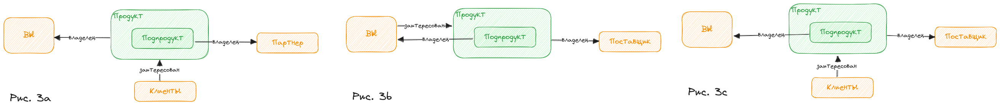
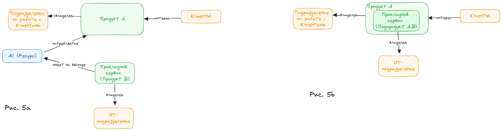

###### :green_book: ba_tutorial.md

---

# Пошаговое руководство по описанию БА с использованием SEAF 1.0

С помощью настоящего руководства:
* вы быстро ознакомитесь с методологией описания БА 
* создадите **минимальное, "крупными мазками"** структурированное описание БА вашей компании
* свяжете Прикладную архитектуру с бизнес-объектами
* выберите дальнейшие направления развития описания БА

Рекомендуем прочитать статьи [про БА](/docs/seaf.ba.entry), [про Экосистему](/docs/seaf.ba.ecosystem_main).

## Окружение Компании

### 0. Вы
Обозначте себя (свою компанию). Вы первый и основной (центральный) Участник ***вашей*** экосистемы.

### 1. Ваши Клиенты
Составьте перечень Клиентских сегментов. Сегментация в разных компаниях может иметь разную детализацию. На данном шаге следует использовать такой уровень сегментации, при котором в вашем окружении будет не более 7 сегментов. Если ваш бизнес ориентирован на нескольких крупных индивидуальных Клиентов, укажите их.

### 2. Ваши Продукты
В общем случае ваши Клиенты заинтересованы во взаимодействии с вами, то есть ожидают от вас некоторую ценность и готовы за это платить. Для того, чтобы такой взаимообмен состоялся, вы создаете ряд механизмов, с помощью которых вы и ваши Клиенты взаимодействуете и передаете друг другу Ресурсы, представляющие ценность для вас и Клиентов. Подобные механизмы -- есть Продукты. По отношению к Продукту обычно есть Владелец -- тот кто создал и поддерживает механизм обмена ценностью, и тот, кто принимает этот механизм и просто использует его, это -- Потребитель.

2.1 Обозначте Продукты, владельцем котторых являетесь именно Вы. 

2.2 Проведите стрелки от Продуктов к Себе и обозначте их как "Владелец".

2.3 Проведите стрелки от Клиентов к Продуктам и обозначте их как "заинтересован". "заинтересован" означает, что Клиент (Сегмент) уже использует ваш Продукт или вы ожидаете, что он будет использовать ваш продукт Продукт, то есть является целевой аудиторией. 

На данном этапе вы уже сможете увидеть, если ваши представления о Клиентских сегментах и о Продуктовом Портфеле несбалансированы.

Если относительно многие сегменты имеют интерес к одному продукту, то возможно:
* данный Продукт слишком обобщен и следует задаться вопросом "может быть это несколько Продуктов на самом деле?"
* данный Продукт является неотъемлемой частью других ваших Продуктов, и следует проверить себя "действительно ли наши клиенты заинтересованы **непосредственно** в этом Продукте?"

Если относительно многие Продукты интересны относительно малому количеству сегментов, то вероятно:
* требуется более детальная сегментация
* необходимо проработать БА в части Драйверы-Участники-Цели/Потребности (не входит в объем данного документа)

### 3. Ваши Поставщики
3.1 Обозначте ваших основных Поставщиков

3.2 Обозначте Продукты, потребителем которых явялется ваша Компания, а Владельцами -- ваши Поставщики

### 4. Партнерские отношения
Продукты могут предоставляться не одним едиственным Участником экосистемы, а в партнерстве (явном или неявном) с другими Участниками.
На данном шаге, важно отразить значимые для вас продуктовые партнерства. Уточните:

4.1 Продукт, владельцем которого является ваша компания, имеет в своем составе Подпродукты других Участников (Партнеров)

4.2 Продукты потребляемые вашей компанией, и являющиеся результатом совместной работы с Поставщиком

4.3 Ваши Продукты, используемые другими Участниками (Партнерами) в составе их Продуктов

### Дальнейшая разработка "Окружения компании"
Окружение может быть описано более подробно. После минимальной проработки "Внутреннего устройства" (см. следующий раздел), можно снова вернуться к Окружению и уточнить:
* Стратегию, конкурентную среду
* Клиентские пути и каналы
* "Дальнеее" Окружение

## Внутреннее устройство компании

### 5. Внутренние Продукты
Разрабатывая понимание Продуктов-Подпродуктов, вы скорее всего обнаружите, что некоторые ваши Продукты имеют составную природу и разные части Продуктов имеют различных Владельцев внутри компании. Таким образом, вы плавно переходите от описания Окружения компании к внутреннему устройству не теряя связи с описанием Окружения:

5.1 Если Ваш Продукт имеет в своем составе хорошо различимые Подпродукты, предоставляемые различными Владельцами внутри вашей компании, отобразите их

5.2 Если внутри компании каким-то образом выделены Продукты, предназначенные для "внутренних клиентов", отобразите их (подробнее см. шаг 6)

### 6. Внутренние Владельцы и Продукты, потоки Ресурсов
Выполняя предыдущее действие (5.2), вы, скорее всего, обнаружите, что явно не вся деятельность компании выражена во внутреннем Продуктовом ландшафте. Шаг 6 -- итеративный, то есть его нужно повторять до тех пор пока описание не обретет целостность. Ниже предлагается алгоритм, который позволит вам
* наращивать объем описания постепенно, не аллоцируя для этого большие ресурсы
* не препятствовать интеграции с прикладной архитектурой -- ИТ-архитектор сразу может использовать то, что уже описано в БАвыполнить
* постепенно вовлеч все заинтересованные стороны в процесс согласования БА малыми частями и избежать полной блокировки БА-функции из-за внутренних противоречий, если они имеются 

Вспомните, что Продукты (и внешние, и внутренние) являются механизмами обмена ценностью. Носителями ценности являются Ресурсы (данные, работа, материальные ценности, деньги и пр.). На данном шаге не следует описывать точные спецификации ресурсов, но необходимо получить общее представление об их типах и маршрутах.

Следующие мероприятия следует выполнять итеративно, пока не будет достигнут консенсус относительно "правильности" отображения внутренней продуктовой структуры среди всех (или большинства) Владельцев Продуктов:

6.1. Представьте себе поток Ресурсов от Продуктов, потребляемых компанией, к Продуктам, предоставляемым компанией:
* если
    * вы можете провести однозначную стрелку от (Под-)Продукта к (Под-)Продукту и обозначить наименование Ресурса, И
    * Ресурс на входе в предоставляемый Продукт является единственно необходимым для реализации обмена ценностью с Клиентом/Партнером
то, вероятно, вы достигли оптимального на данный момент уровня детализации  (при заданной детализации внешних Продуктов)
* иначе
стрелку следует "разбить" неким внутренним Продуктом (или несколькими)

6.2 Оцените полноту входящих Ресурсов в каждый (Под-)Продукт -- проведите интервью с Владельцами. Добавьте недостающие. Проверьте, что Ресурсы не "висят" в воздухе, а явлются выходами из (Под-)Продуктов.

6.3 Проверьте, что отсутсвуют Продукты без исходящих Ресурсов. Дополните описание при необходимости.

6.4 Повторяйте 6.1 - 6.3 до тех пор, пока все ресурсные потоки не обретут непрерывность от Потребляемых внешних Продуктов до предоставляемых внешних продуктов.

### 7. Прикладные сервисы

В SEAF 1.0 связь Прикладной архитектуры и БА осуществляется через Прикладные сервисы. Представьте себе АС (деплоймент). В общем случае, Пользователь выполняет с помощью АС некоторые действия, предусмотренные Процессом Х, который является частью некоторого Продукта А (процессы в данном документе не рассматриваются, поэтому будем считать, что в Продукте всегда есть "какие-то" процессы). То есть будет справедливым сказать, что АС является ценным Ресурсом для Продукта А. Но Ресурс -- это всегда выход из какого-то Продукта B. То есть существует Продукт B в рамках которого происходит передача  Ресурса "АС" в Продукт А (для выполнения Процесса X или конкретного действия Х.х в Процессе Х). На рисунке 5 приведены два варианта отображения связи БА и Прикладной архитектуры -- развернутый и сокращенный соответственно.

### Дальнейшая разработка "Внутреннего устройства"
* Процессы и потоки ресурсов
* Спецификации ресурсов и Способности (Capabilities)
