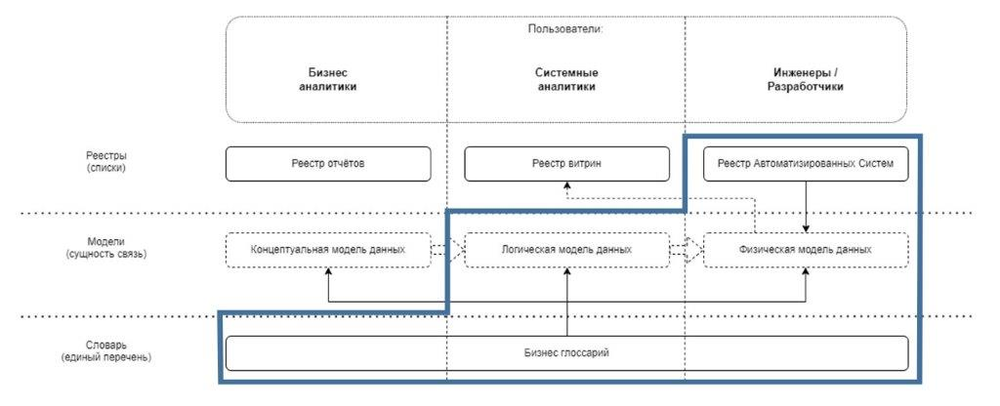

# СОДЕРЖАНИЕ
1. [ОБЩИЕ ПОЛОЖЕНИЯ](#1-общие-положения)
2. [ЦЕЛИ И ЗАДАЧИ](#2-цели-и-задачи)
3. [КЛАССИФИКАЦИЯ МЕТАДАННЫХ](#3-классификация-метаданных)
4. [РОЛИ И УЧАСТНИКИ](#4-роли-и-участники)
5. [ПРОЦЕССЫ. ВЕРХНЕУРОВНЕВОЕ ОПИСАНИЕ](#5-процессы-верхнеуровневое-описание)

[ПРИЛОЖЕНИЕ 1](#приложение-1)

# 1. ОБЩИЕ ПОЛОЖЕНИЯ
Регламент управления метаданными (далее - Регламент) устанавливает цели, определяет объекты управления, описывает функции ролей и регламентирует основные этапы процесса управления метаданными.
Порядок назначения и функции ролей определены в политике по управлению данными (далее – Политика). В настоящем регламенте уточняются функции ролей применительно к процессу управления метаданными.
Требования, утвержденные в соответствии с положениями настоящего Регламента, являются обязательными для соблюдения всеми участниками процесса. Ответственность сотрудника за качество данных определяется в соответствии с назначенной ролью.

# 2. ЦЕЛИ И ЗАДАЧИ
Целью управления метаданными является обеспечение сотрудников и процессов непротиворечивой, актуальной и достоверной информацией об имеющихся в компании данных.
Задачи:
1. Обеспечение единого понимания бизнес-терминов и их согласованного использования в масштабах организации.
2. Сбор и интеграция метаданных из различных источников.
3. Стандартизация доступа к метаданным.
4. Обеспечение качества и безопасности метаданных.

# 3. КЛАССИФИКАЦИЯ МЕТАДАННЫХ
Классификация метаданных по типу описания.
## Определение классов описания данных:
### Бизнес-глоссарий
 - перечень бизнес-сущностей и терминов, используемых в процессах и продуктах    компании, обеспечивающий их единообразное понимание.

### Концептуальная модель данных
 - минимально необходимое множество понятий и семантических связей между ними, определяющих используемую в компании информацию.

### Логическая модель данных
 - перечень сущностей, их взаимосвязей и атрибутов.

В логической модели сущности из концептуальной модели данных/бизнес-глоссария преобразуются в логические сущности с атрибутами.
На логическом уровне модель данных независима от каких-либо технологических ограничений, которые возникают и учитываются на стадии реализации.

### Физическая модель данных
 - описание технической реализации, включающее в себя структуры хранения данных, как правило, основанное на логической модели.

Физическая модель данных разрабатывается с учётом конкретных технологий.

### Реестр АС
 - реестр автоматизированных систем, функциональных подсистем.

### Реестр витрин
 - перечень витрин, внедренных или планируемых к внедрению на КХД.

### Реестр отчетов
 - таблицы с аналитической информацией бизнес уровня.

Описанные выше классы проектируются, используя специализированные инструменты.
Для функции управления метаданными реализуется табличное представление сущностей и атрибутов классов.

## Схема взаимосвязей и назначения классов

## Описание мета-атрибутов классов
### Бизнес-глоссарий
#### Таблица терминов
Мета атрибуты|Требования
:------------  | :------------
Наименование|Существительное в единственном числе именительного падежа (исключение составляют термины, чья форма существует только во множественном числе). Должно начинаться со стандартного слова, характеризующего тип термина. Должно быть максимально уникальным
Описание|В описании термина не должны присутствовать сокращения. Логическое раскрытие термина. Должно быть составлено таким образом, чтобы смысл термина был понятен. В описании термина не должны присутствовать сокращения
Статус|Выбирается из списка: черновик/ используется/ архив
Дата внесения термина|Дата внесения термина в инструмент описания
Дата изменения термина|Дата последнего изменения термина в инструменте описания
Ответственный (ФИО)|ФИО отвечающего за заполнение термина
Комментарий|Комментарий работника, заполнение не обязательно
Нормативный/правовой документ|Ссылка на нормативные, правовые, организационные документы, рабочие пространства, которые определяют и контролируют этот термин при использовании в бизнес процессах. Заполнение не обязательно

### Концептуальная модель данных
Мета атрибуты|Требования
:------------  | :------------
Код|Уникальная в рамках модели аббревиатура в стиле.
Наименование|Наименование на русском языке в единственном числе, уникальное в рамках модели
Описание|Описание сущности с точки зрения бизнеса; сведения о ее назначении, способе использования, и имеющихся ограничениях
Примечание:
Бизнес-глоссарий является отображением концептуальная модель данных.
При адаптации данного регламента компания должна выбрать какие классы использовать: Бизнес-глоссарий или концептуальная модель данных.

### Логическая модель данных
#### Таблица сущностей
Мета атрибуты|Требования
:------------  | :------------
Код |Уникальная в рамках модели аббревиатура в стиле
Наименование|Существительное в единственном числе или словосочетание на его основе (составной термин), уникальное в рамках модели
Описание|Описание сущности с точки зрения бизнес-процессов; сведения о ее назначении, способе использования и имеющихся ограничениях
Ссылка на термин|Указывается ссылка на соответствующие термины Бизнес-глоссария или сущности концептуальной модели данных
#### Таблица атрибутов
Мета атрибуты|Требования
:------------  | :------------
Код|Уникальная в рамках модели аббревиатура в стиле
Наименование|Наименование на русском языке в единственном числе, уникальное в рамках модели
Описание|Описание атрибута с точки зрения бизнеса; сведения о ее назначении, способе использования, и имеющихся ограничениях
Ссылка на сущность|Ссылка на сущность соответствующей логической модели, к которой принадлежит атрибут
Ссылка на термин|Указывается ссылка на соответствующие термины Бизнес-глоссария или сущности концептуальной модели данных.
Ссылочный атрибут|Ссылка на связанный экземпляр сущности

### Физическая модель данных
Примечание: при адаптации регламента компания добавляет дополнительные необходимые атрибуты для конкретизации физического нахождения таблиц: контур, СУБД, хост и т.п.

#### Перечень физических таблиц
Одна строка соответствует одной таблице:

Мета атрибуты|Требования
:------------  | :------------
Наименование|Имя таблицы (должно соответствовать правилам наименования принятым в компании)
Назначение|Описание назначения таблицы в текстовом формате
АС|Наименование АС, к которой относится таблица
СУБД|СУБД АС, к которой относится таблица
БД|БД, в которой находится таблица
Схема|Схема в конкретной АС
Ссылка на сущность в логической модели|Ссылка на соответствующую сущность в логической модели
#### Таблица атрибутов
Мета атрибуты|Требования
:------------  | :------------
Наименование|Имя атрибута (должно соответствовать правилам наименования принятым в компании)
Описание|Описание назначения атрибута в текстовом формате
Тип|Указание типа атрибута
Ограничения|Перечень ограничений для данного атрибута
Таблица|Имя физической таблицы, к которой принадлежит атрибут

### Реестр АС
Мета атрибуты|Требования
:------------  | :------------
Краткое наименование|Наименование АС с использованием аббревиатур и сокращений
Полное наименование|Наименование АС без использования аббревиатур или сокращений. Добавляется при необходимости
Статус|Выбирается из списка: в разработке/ опытная эксплуатация/ промышленная эксплуатация/ выведена из эксплуатации
Назначение|Описание назначения системы в текстовом формате
Текстовое описание|Текстовое описание назначения АС, включает в себя актуальный перечень основных поддерживаемых процессов и функций
Владелец|Указывается ФИО владельца АС

### Реестр витрин
Мета атрибуты|Требования
:------------  | :------------
Наименование|Уникальное наименование витрины
Назначение витрины|Описание назначения витрины в текстовом формате. Указать цель создания витрины
Статус|Выбирается из списка: в разработке/ используется/ архив
АС хранения|АС, реализующая хранилище данных на котором создана витрина
Схема|Схема в конкретной АС, в которой реализована витрина
Частота обновления|Указываются требования заказчика к частоте обновления витрины. Например, ежедневно, раз в неделю и др.
Время завершения обновления|Указываются требования заказчика ко времени, к которому витрина должна быть обновлена.
Актуальность данных|Указывается актуальность витрины. Например, Т-1, Т-2 и др.
Разрешенные потребители|Перечень пользователей, которым разрешен запрос на доступ к данным витрины.
Перечень источников|Список таблиц физической модели, на которых строится витрина.
Владелец данных витрины|Сотрудник с функциями в соответствии с Политикой. ФИО необходимо писать полностью, а также предоставлять адрес электронной почты и контактную информацию
Инженер витрины|Сотрудник, ответственный за сопровождение витрины. ФИО необходимо писать полностью, а также предоставлять адрес электронной почты и контактную информацию
Требования к созданию|Описание постановки задачи на создание витрины.

### Реестр отчетов
Мета атрибуты|Требования
:------------  | :------------
Наименование|Уникальное наименование отчёта
Назначение|Описание назначения отчёта в текстовом формате
Статус|Выбирается из списка: в разработке/ используется/ архив
Частота обновления|Указываются требования заказчика к частоте обновления отчёта. Например, ежедневно, раз в неделю и др
Время завершения обновления|Указываются требования заказчика ко времени, к которому отчёт должна быть обновлена
Актуальность данных|Указывается актуальность отчёта. Например, Т-1, Т-2 и др.
Разрешенные потребители|Перечень пользователей, которым разрешен запрос на доступ к отчёту
Владелец отчёта|Сотрудник с функциями в соответствии с Политикой
Разработчик отчёта|Сотрудник, ответственный за сопровождение отчёта
Требования к созданию|Описание постановки задачи на создание отчёта

# 4. РОЛИ И УЧАСТНИКИ
Данный раздел определяет основные роли и их функционал в рамках процесса управления метаданными.

## Ответственный за термин Бизнес-глоссария
- актуализация терминов бизнес-глоссария;
- согласование изменений терминов бизнес-глоссария.

## Дата стюард
- изменение/добавление терминов бизнес-глоссария;
- мониторинг метаданных моделей;
- актуализация метаданных моделей.

## Владелец АС
- изменения в реестре АС.

## Инженер данных
- мониторинг реестров витрин/отчётов;
- актуализация реестров витрин/отчётов.

# 5. ПРОЦЕССЫ. ВЕРХНЕУРОВНЕВОЕ ОПИСАНИЕ
Процессы управления изменениями в метаданных в зависимости от классификации:
## Бизнес глоссарий:
Ответственный за процесс ведения бизнес глоссария – дата стюард.
Заявки на изменение/добавление терминов принимаются от участников процесса.
### Изменение/добавление терминов в бизнес-глоссарий
1. формирование выборки терминов для рассмотрения внесения изменений;
выборка формируется на основании типовых правил: термин давно не обновлялся, есть заявки от пользователей на внесение изменений и т.п.
2. проверка по выборке;
проверяется есть ли уже существующий термин, корректно ли предложенное описание.
3. согласование предложений с ответственным за заполнение термина;
4. финальные изменения;
   - по результатам согласования выбирается один из возможных вариантов изменения:
   - создать новый термин;
   - оставить термин без изменений;
   - поставить на контроль;
   - внести изменения в атрибуты;
   - присвоить статус «архив»;
   - объединить: создание нового термина (заполнение атрибутов из объединяемых терминов), архивация объединяемых терминов с указанием ссылки на новый термин в поле статус;
   - разделить: создание новых терминов (заполнение атрибутов на основе мастер термина), архивация мастер термина с указанием ссылки на новые термины в поле статус.
5. уведомление пользователей (по подписке).

## Концептуальная модель, Логическая модель, Физическая модель
Для уровня моделей должна быть реализована автоматическая загрузка сущностей в реестры метаданных.
Ответственный за мониторинг и актуализацию метаданных моделей – дата стюард.
### Мониторинг ошибок загрузки
1. загрузка данных из модели;
2. мониторинг ошибок загрузки;
3. запрос к архитектору;
4. актуализация данных.

### Актуализация сущностей
1. обратная связь по актуализации сущностей;
2. отправка архитектору заявки на изменение;
3. ответ от архитектора:
   - изменения внесены;
   - отказ.

## Реестр АС
Владелец АС уведомляет стюарда о необходимости изменений в реестр.
1. владелец АС создаёт запрос на добавление/изменения АС и уведомляет стюарда;
2. дата стюард производит валидацию запроса (проверка на дубль, полнота требований):
   - отказ;
   - уточнение данных;
3. дата стюард производит внесение изменений в реестр.

## Реестр витрин, реестр отчётов
Для витрин и отчётов должна быть реализована автоматическая загрузка сущностей в реестры метаданных.
Мониторинг и регулярную актуализацию реестра производит инженер данных.

### Мониторинг ошибок загрузки реестра
1. обновление реестра;
2. мониторинг ошибок загрузки;
3. формирование выборки по результатам мониторинга.
4. запрос к владельцу данных;
   - следующий шаг выполняется после уведомления от владельца данных о корректировках на источнике.
5. ручной запуск обновления реестра.

### Регулярная проверка актуальности реестра
1. формирование выборки кандидатов на архивацию;
2. запрос к владельцу данных;
3. финальные изменения:
   - актуализация данных
   - архивация

# ПРИЛОЖЕНИЕ 1
## Перечень сокращений
АС – Автоматизированная система\
ВНД – Внутренний нормативный документ\
CDO – Chief data officer / Директор по данным\
БД – База данных\
СУБД – Система управления базой данных
